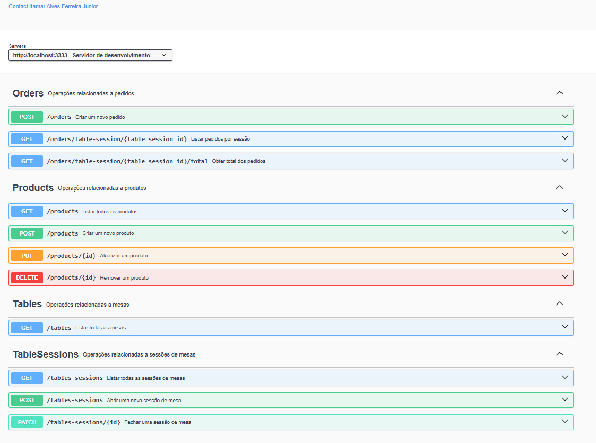

# API Restaurante

Uma API RESTful para gerenciamento de restaurante, com recursos para controlar mesas, sessões, produtos e pedidos.

## Funcionalidades

- Gerenciamento de mesas (cadastro e listagem)
- Controle de sessões de mesa (abertura e fechamento)
- Cadastro de produtos (criação, edição, listagem e exclusão)
- Gerenciamento de pedidos (criação, listagem por sessão e cálculo de total)

## Tecnologias

- Node.js
- TypeScript
- Express
- Knex (Query Builder)
- SQLite
- Zod (Validação)
- Swagger (Documentação)

## Instalação

```bash
# Clone o repositório
git clone https://github.com/ItamarJuniorDEV/api-restaurant.git

# Entre na pasta do projeto
cd api-restaurant

# Instale as dependências
npm install

# Execute as migrações
npm run migrate

# Execute as sementes (opcional)
npm run seed

# Inicie o servidor
npm run dev
```

## Documentação da API

A documentação completa da API está disponível através do Swagger UI.

Para acessar, inicie o servidor e acesse: [Swagger UI](http://localhost:3333/api-docs)



## Endpoints

| Recurso     | Método  | Endpoint                              | Descrição                        |
|------------|---------|----------------------------------|--------------------------------|
| Produtos   | `GET`   | `/products`                      | Lista todos os produtos       |
| Produtos   | `POST`  | `/products`                      | Cria um novo produto          |
| Produtos   | `PUT`   | `/products/:id`                  | Atualiza um produto           |
| Produtos   | `DELETE`| `/products/:id`                  | Remove um produto             |
| Mesas      | `GET`   | `/tables`                        | Lista todas as mesas          |
| Sessões    | `GET`   | `/tables-sessions`               | Lista todas as sessões        |
| Sessões    | `POST`  | `/tables-sessions`               | Abre uma nova sessão          |
| Sessões    | `PATCH` | `/tables-sessions/:id`           | Fecha uma sessão              |
| Pedidos    | `POST`  | `/orders`                        | Cria um novo pedido           |
| Pedidos    | `GET`   | `/orders/table-session/:id`      | Lista pedidos de uma sessão   |
| Pedidos    | `GET`   | `/orders/table-session/:id/total` | Obtém o total dos pedidos   |

## Licença

Este projeto está licenciado sob a licença MIT.

## Autor

Itamar Alves Ferreira Junior

